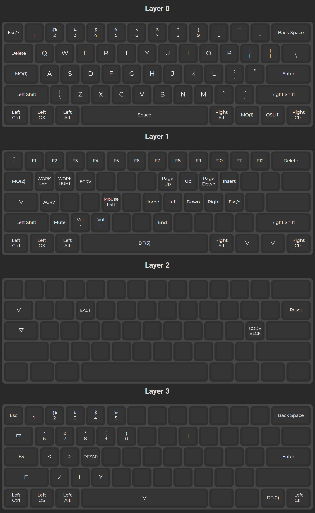

This is the homepage for anything related to keyboards

## QMK

To install QMK :

- Follow the setup procedure on [QMK Documentation](docs.qmk.fm)
- Run [this gist](https://gist.github.com/joscherrer/e1274d2c49884b12ed3f9af14dd3a4e7) to clone all the custom keymaps
```bash
curl -fsSL https://git.io/J9GFJ | python3 - -f
```

## Keymaps

To create a new keymap :

- Create a github repository
- Set the following topics on the repo :
    - `qmk`
    - `kb--<keyboard>` (keyboard path with `/` replaced by `-`)
    - `km--<keymap>`

For example, on a repo for the ai03 polaris keyboard the topics should be :
- `qmk`
- `kb--ai03-polaris`
- `km--jonathan`

### Example

```bash
printf "keyboard: " >&2; read -r keyboard
printf "keymap: " >&2; read -r keymap
printf "Repo name: " >&2; read -r repo_name
keyboard=$(tr '/' '-' <<< $keyboard | sed 's/_/---/')

gh repo create "$repo_name" --public
gh repo edit joscherrer/$repo_name --add-topic qmk --add-topic "km--${keymap}" --add-topic "kb--$keyboard"
```

## Layout

Here is my current layout


